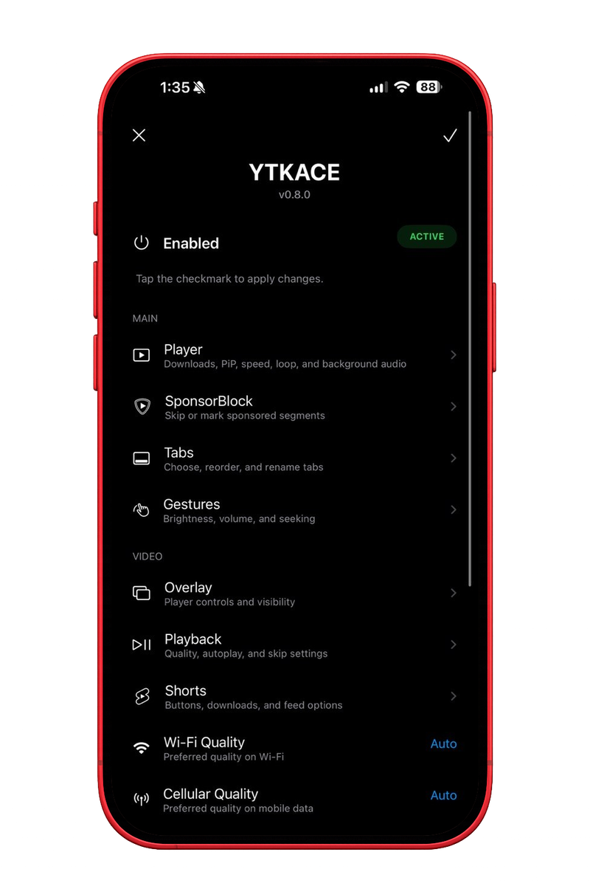
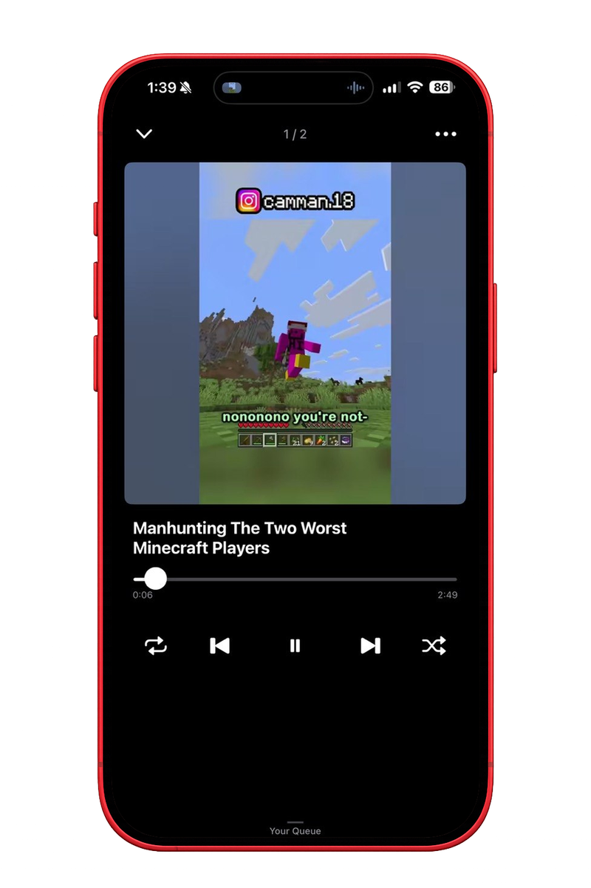
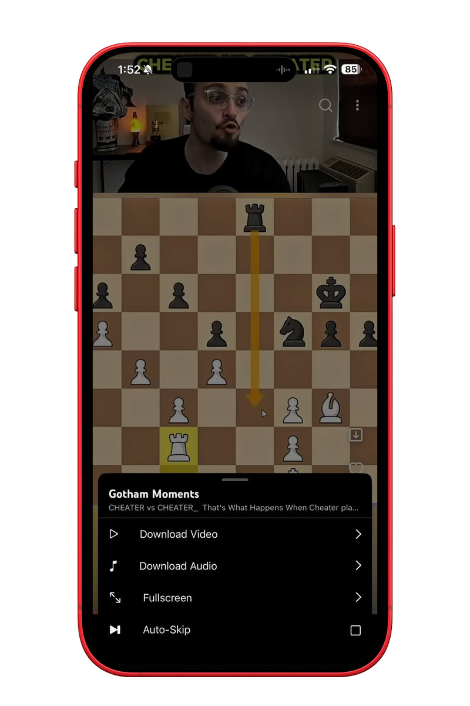
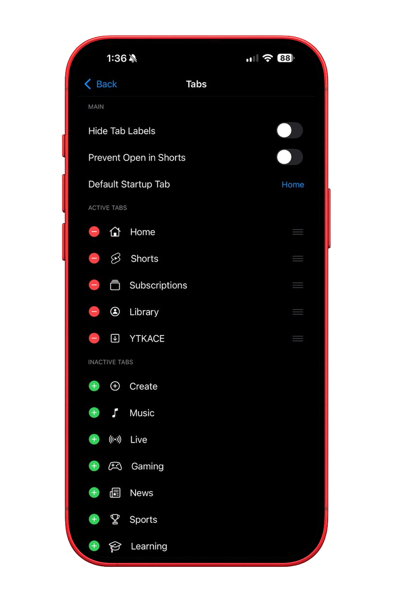
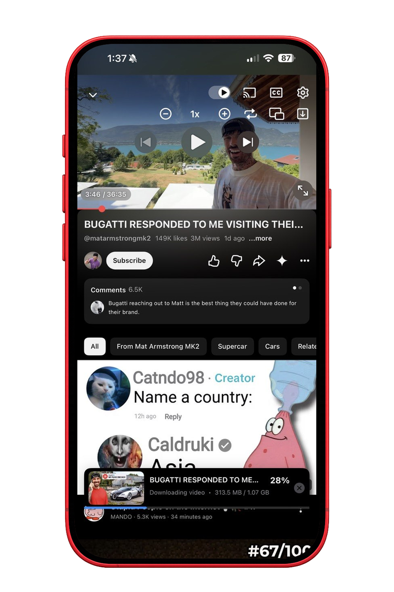
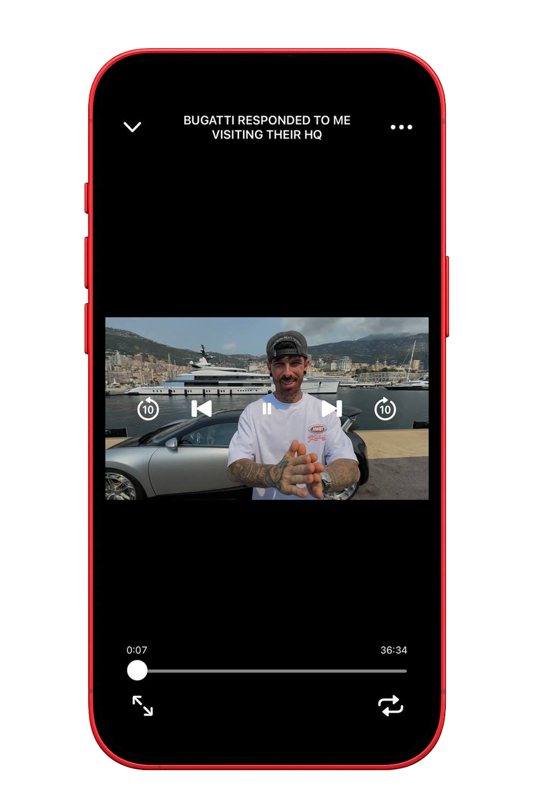
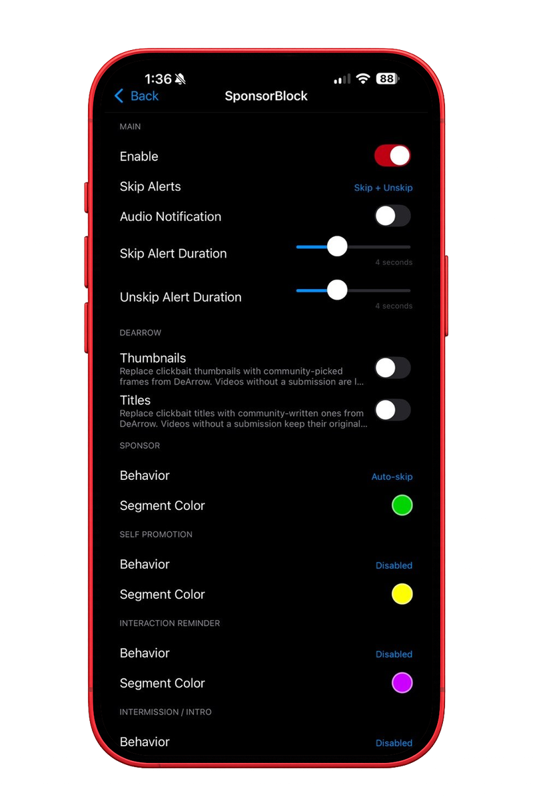
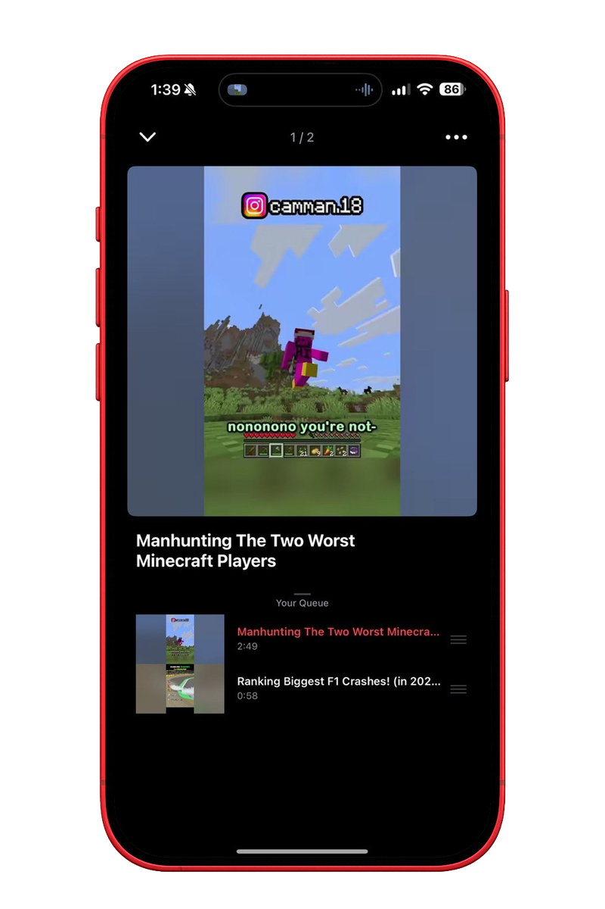

# YTKACE

An open-source YouTube enhancement for iOS.

## Features

| Area | Included |
|---|---|
| Downloads | Video, audio and Shorts downloads; queues; sorting; backup and restore |
| Playback | Background playback, PiP, loop, speed controls, default speed, gestures and tap to seek |
| SponsorBlock | Category controls, progress markers, skip modes and configurable alerts |
| Interface | OLED mode, overlay controls, navigation cleanup and native share sheets |
| Tabs | Hide, reorder and add YouTube destinations |
| Library | Downloaded video, Shorts and audio players with resume support |
| Settings | Searchable settings, 15 languages and a native YouTube settings section |

## Compatibility

- **iOS:** 16.0 and newer
- **Architecture:** arm64
- **Latest confirmed YouTube:** 21.33.6
- **YTKACE:** 0.9.0

The same injected IPA can be installed with TrollStore or a developer-certificate sideloader.

## Install

**Jailbroken.** Add the repository in Sileo, Zebra or Cydia:

```
https://itzzace.github.io/ytkace/
```

Rootless and roothide packages are both published. The repository page also has an
[Add to Sileo](https://itzzace.github.io/ytkace/) button.

**Sideloaded.** Download the IPA from the [latest release](https://github.com/itzzace/ytkace/releases/latest)
and install it with TrollStore, AltStore, SideStore or LiveContainer.

## Build

Fork the repository, enable Actions, open the **IPA** workflow and provide a direct link to a decrypted YouTube IPA you are legally allowed to use. The completed workflow provides the injected IPA as an artifact. The **Deb** workflow builds the tweak package.

## Settings

Open the YTKACE tab and tap the gear, or open YouTube Settings and choose YTKACE.
Both pages carry the same options, and the YouTube Settings section has a search bar.

## Screenshots

<p align="center">
  
  
  
</p>

<p align="center">
  <sub>Settings · Downloads · Audio Player</sub>
</p>

<details>
  <summary>More screenshots</summary>
  <br>
  <p align="center">
    
    
    
  </p>
  <p align="center">
    
    
    
  </p>
  <p align="center">
    
    
  </p>
</details>

## Privacy

YTKACE has no activation service, analytics, telemetry or updater.

## Audit

After the copying claims I went through the project properly instead of arguing about it. This is what was checked and what came back.

Every commit, branch and tag in this repository was searched. No file from another tweak has ever been committed here. What did exist was naming: four method names carrying another project's prefix in the old playback fix, a settings key read so people migrating kept their preferences, and checks in the build scripts asserting that project's files were absent. The method names are gone and the file they lived in no longer exists.

The playback fix was rewritten from a written specification rather than edited. It went from 970 lines and 55 hooks across about 20 classes to four hooks over a state machine, with eleven tests that run without a device. Timings and recovery behaviour were chosen fresh and are documented with the reasoning.

Wording that read too close to another project was rewritten in English and retranslated into all fourteen other languages. Five missing keys were added everywhere, three broken placeholders were fixed, and Japanese was made reachable after sitting unused in the bundle.

The bundle ships one image, SponsorBlock's shield. Everything else in the interface is an SF Symbol or an image already inside YouTube, requested by name at runtime.

A clone taken fresh from GitHub builds byte for byte identical to the local build. The resulting binary contains no reference to any other project, links only Apple frameworks plus libz, libc++ and libSystem, and every class it defines carries the YTKACE prefix.

## Notes

I'm sorry. The pre 0.8.0 code was stolen and I didn't say that when people started asking, which is the part I feel worst about. I personally think what's in the app now has been rewritten and changed enough that it isn't the same thing anymore. What I checked is above, judge it yourself.

iKarwan, I should have talked to you privately instead of letting it turn into a public thing. If something of yours is still in here, show me where and I'll take it out.

ZomkaDEV, you helped in good faith and got pulled into something you didn't sign up for. Your commits are removed and your work has been rewritten out of the current code, like you asked. Sorry for dragging you into it.

[jaydenjcpy](https://github.com/jaydenjcpy), thanks for hosting the builds while you did. I wish you'd asked me for my side before blocking me. I get why you didn't want to be near this.

[ballermc](https://github.com/ballermc), you pulled YTKACE from TubeVault and said you don't support mods that take code from other mods. I'm not going to argue with that or ask you to change it. Sorry for putting you in that spot.

I'm not asking to be forgiven for any of it, I just wanted it said instead of people guessing.

## License

YTKACE source is available under the [MIT License](LICENSE). See [Third-Party Notices](THIRD_PARTY_NOTICES.md) for components and services with separate terms.
